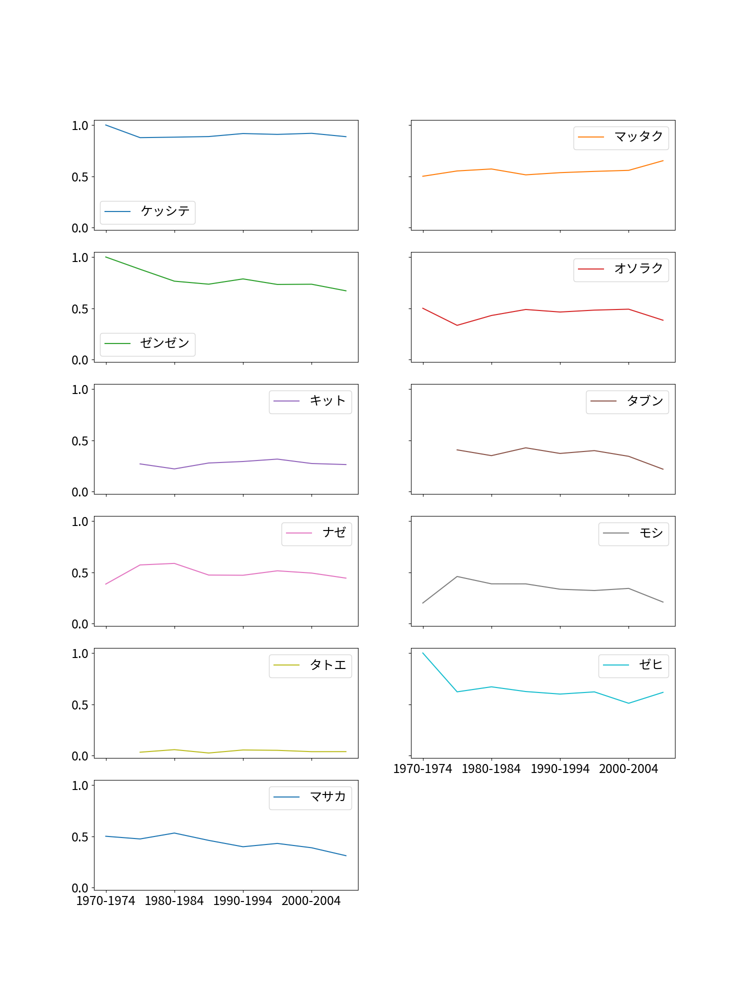

# Clone方法
非常に大きなファイル(50MB以上)を含むため、データセットはGit LFSを使用しております。
```
git lfs clone git@github.com:ogadra/adverb.git
```
でクローンするか、以下の手順に従ってデータセットを直接BCCWJからダウンロードしてください。

# データセットの準備

[BCCWJ](https://chunagon.ninjal.ac.jp/)、現代日本語書き言葉均衡コーパスを用いる。

## 検索条件

### 短単位検索
キー == {"語彙素読み" : $任意の副詞$, "品詞" : {"大分類" : "副詞"}}

### 検索対象
お好みで。

### 検索動作
文脈中の区切り記号 == "なし"
文脈中の文区切り記号 == ";"
前後文脈の語数 == (可能な限り長く)

### ダウンロードオプション
文字コード == "UTF-8"

このレポジトリにあるデータセットの検索条件式
```
キー: (語彙素読み="ケッシテ" AND 品詞 LIKE "副詞%")
  WITH OPTIONS tglKugiri="" AND tglBunKugiri=";" AND limitToSelfSentence="1" AND tglFixVariable="2" AND tglWords="500" AND unit="1" AND encoding="UTF-8" AND endOfLine="CRLF";
キー: (語彙素読み="マッタク" AND 品詞 LIKE "副詞%")
  WITH OPTIONS tglKugiri="" AND tglBunKugiri=";" AND limitToSelfSentence="1" AND tglFixVariable="2" AND tglWords="500" AND unit="1" AND encoding="UTF-8" AND endOfLine="CRLF";
キー: (語彙素読み="ゼンゼン" AND 品詞 LIKE "副詞%")
  WITH OPTIONS tglKugiri="" AND tglBunKugiri=";" AND limitToSelfSentence="1" AND tglFixVariable="2" AND tglWords="500" AND unit="1" AND encoding="UTF-8" AND endOfLine="CRLF";
キー: (語彙素読み="オソラク" AND 品詞 LIKE "副詞%")
  WITH OPTIONS tglKugiri="" AND tglBunKugiri=";" AND limitToSelfSentence="1" AND tglFixVariable="2" AND tglWords="500" AND unit="1" AND encoding="UTF-8" AND endOfLine="CRLF";
キー: (語彙素読み="タブン" AND 品詞 LIKE "副詞%")
  WITH OPTIONS tglKugiri="" AND tglBunKugiri=";" AND limitToSelfSentence="1" AND tglFixVariable="2" AND tglWords="500" AND unit="1" AND encoding="UTF-8" AND endOfLine="CRLF";
キー: (語彙素読み="キット" AND 品詞 LIKE "副詞%")
  WITH OPTIONS tglKugiri="" AND tglBunKugiri=";" AND limitToSelfSentence="1" AND tglFixVariable="2" AND tglWords="500" AND unit="1" AND encoding="UTF-8" AND endOfLine="CRLF";
キー: (語彙素読み="ナゼ" AND 品詞 LIKE "副詞%")
  WITH OPTIONS tglKugiri="" AND tglBunKugiri=";" AND limitToSelfSentence="1" AND tglFixVariable="2" AND tglWords="500" AND unit="1" AND encoding="UTF-8" AND endOfLine="CRLF";
キー: (語彙素読み="モシ" AND 品詞 LIKE "副詞%")
  WITH OPTIONS tglKugiri="" AND tglBunKugiri=";" AND limitToSelfSentence="1" AND tglFixVariable="2" AND tglWords="500" AND unit="1" AND encoding="UTF-8" AND endOfLine="CRLF";
キー: (語彙素読み="タトエ" AND 品詞 LIKE "副詞%")
  WITH OPTIONS tglKugiri="" AND tglBunKugiri=";" AND limitToSelfSentence="1" AND tglFixVariable="2" AND tglWords="500" AND unit="1" AND encoding="UTF-8" AND endOfLine="CRLF";
キー: (語彙素読み="ゼヒ" AND 品詞 LIKE "副詞%")
  WITH OPTIONS tglKugiri="" AND tglBunKugiri=";" AND limitToSelfSentence="1" AND tglFixVariable="2" AND tglWords="500" AND unit="1" AND encoding="UTF-8" AND endOfLine="CRLF";
キー: (語彙素読み="マルデ" AND 品詞 LIKE "副詞%")
  WITH OPTIONS tglKugiri="" AND tglBunKugiri=";" AND limitToSelfSentence="1" AND tglFixVariable="2" AND tglWords="500" AND unit="1" AND encoding="UTF-8" AND endOfLine="CRLF";
キー: (語彙素読み="マサカ" AND 品詞 LIKE "副詞%")
  WITH OPTIONS tglKugiri="" AND tglBunKugiri=";" AND limitToSelfSentence="1" AND tglFixVariable="2" AND tglWords="500" AND unit="1" AND encoding="UTF-8" AND endOfLine="CRLF"
```

# 実行環境
adverb.py -> {
    'Python': '3.8以上(32bit)',
    '必要追加パッケージ': ['mecab', 'cabocha-python']
    }
makeGraph.py -> {
    'Python': '3系',
    '必要追加パッケージ': ['matplotlib', 'pandas']
    }
 
 # 実行方法
 1. adverb.pyでデータセットから年別データ(result.csv)を作成
 2. makeRate.pyでresult.csvから5年毎の対応率(result-rate.csv)を作成
 3. makeGraph.pyでresult-rate.csvからグラフ画像(imgs/graph.png)を作成
 
 
 
 # その他ファイルの解説
 - adverbList.json -> 分析する呼応の副詞のデータを入力する。自分でデータセットを用意する場合は要編集。adverb.pyで使用。
った文章のデータ。adverb.pyより作成。 - exception.csv -> 呼応の関係が見られなか

# 分析環境
レポジトリ作成者は以下の分析環境で分析した。
分析環境

|係り受け解析||統計||
|--:|--:|--:|--:|
|Anaconda Python | 3.9.1(32bit)|Anaconda Python | 3.9.1(64bit)|
|cabocha-python | 0.69.1|matplotlib | 3.3.2 |
|mecab | 0.996.2| pandas | 1.2.1|
|| scikit-learn | 0.23.2|
